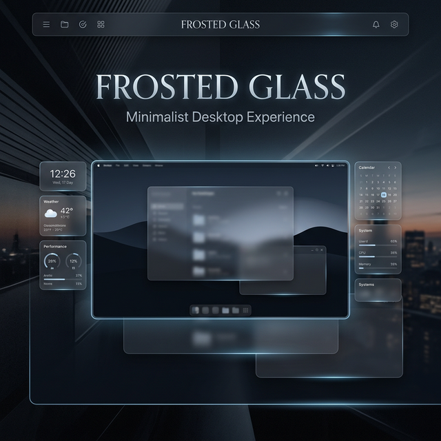

# ❄️ Frosted Glass Suite

**A Premium, Minimalist Desktop Experience for Rainmeter**

---

Frosted Glass is a sophisticated Rainmeter suite designed with a "dark luxury" aesthetic. It utilizes advanced glassmorphism effects, smooth micro-animations, and a refined editorial layout to transform your desktop into a professional workstation.

[Explore Features](#-features) • [Quick Start](#-installation) • [Customization](#-customization)

---

## ✨ Features

- **💎 Glassmorphism UI**: High-fidelity frosted glass effects with dynamic blurring.
- **📊 System Monitoring**: Real-time CPU, RAM, and Network tracking with sleek visualizations.
- **🕒 Minimalist Clock**: Elegant time and date display with customizable formats.
- **🚀 Quick Launch Dock**: Interactive application dock with hover states.
- **🌦️ Weather Integration**: Live weather updates with custom-designed iconography.
- **⚡ Optimized Core**: Re-engineered for minimal resource impact and high performance.

## 🚀 Installation

1. **Prerequisites**: Ensure you have [Rainmeter](https://www.rainmeter.net/) (v4.5.17 or higher) installed.
2. **Download**: Clone this repository or download the `.rmskin` package from the [Releases](https://github.com/SINdomX/Frosted-Glass/releases) page.
3. **Setup**: Move the `Frost Glass Skin` folder to your Rainmeter Skins directory:
   `C:\Users\<YourUser>\Documents\Rainmeter\Skins\`
4. **Load**: Open Rainmeter Manager and load the desired `.ini` files from the suite.

## 🛠️ Customization

The suite is highly configurable via the `@Resources` variables:

- **Colors & Transparency**: Global accent colors and glass opacity can be tuned in `Variables.inc`.
- **Scaling**: Full support for High-DPI displays with adjustable scale factors.
- **Global Settings**: Use the included **(!) Settings** skin for a GUI-based configuration experience.

## 📸 Preview

> [!NOTE]
> For the best visual experience, use a minimalist dark wallpaper to accentuate the frosted glass transparency.

---

### Designed with ❤️ by [SINdomX](https://github.com/SINdomX)

*Elevate your digital space.*

